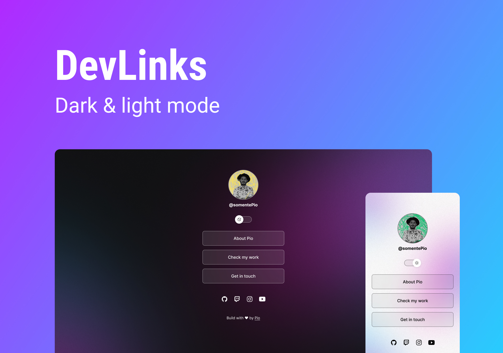

 
<h1 align="center"> My first project </h1>
 

Developed with mentorship from <a href="https://github.com/maykbrito">@maykbrito</a> of RocketSeat  
<a href="rocketseat.com.br">Click here to know more about RocketSeat</a>

  <a href="#-tecnologias">Tecnologias</a>&nbsp;&nbsp;&nbsp;|&nbsp;&nbsp;&nbsp;
  <a href="#-projeto">Projeto</a>&nbsp;&nbsp;&nbsp;|&nbsp;&nbsp;&nbsp;
  <a href="#-layout">Layout</a>&nbsp;&nbsp;&nbsp;|&nbsp;&nbsp;&nbsp;
  <a href="#memo-licença">Licença</a>

  

 

  

 
 

## 🚀 Tecnologias

Techs used to build this project:

- HTML e CSS
- JavaScript
- Git e Github
- Figma

 
 

## 💻 Projeto

A link aggregator to use as an online business card

- [Acesse o projeto finalizado, online](#)

 
 

<!-- ## 🔖 Layout

Você pode visualizar o layout do projeto através [DESSE LINK](#).

 
  -->

## 📝 Licença

Esse projeto está sob a licença MIT.

---

Developed with ♥ by Pio
